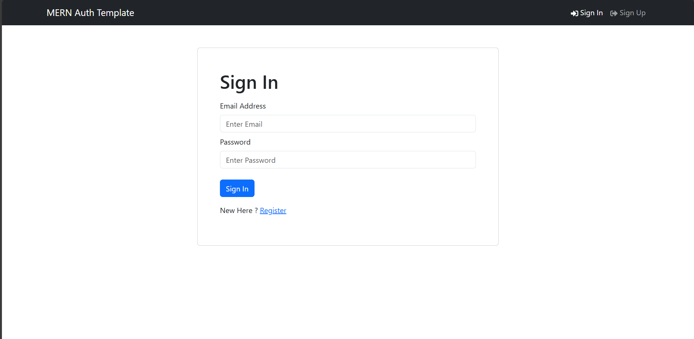
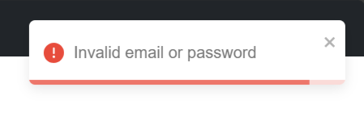

# MERN Authentication Project

This project is a full-stack MERN (MongoDB, Express, React, Node.js) application that demonstrates a robust authentication system. It consists of a React-based frontend and an Express.js backend, both working together to provide a secure and user-friendly authentication experience.

## Overview

- **Client**: A React application using Redux for state management, React Router for navigation, and React-Bootstrap for UI components. It includes features like user registration, login, logout, and profile management.

- **Server**: An Express.js server that handles API requests, user authentication, and database operations. It uses MongoDB for data storage, JWT for token-based authentication, and includes middleware for protected routes.

For more detailed information:
- [Client README](./client/README.md)
- [Server README](./server/README.md)

## Application Screenshots

### Home Page


### Login Page


### Profile Page


### Toast Notification


## Quick Start

To run both the frontend and backend concurrently:

1. Ensure you have Node.js and npm installed.
2. Clone this repository.
3. Create a `.env` file in the root directory with necessary environment variables.
 ```
   PORT=5000
   MONGO_URI=your_mongodb_connection_string
   NODE_ENV=development/production
   JWT_SECRET=your_jwt_secret
   ```
4. Install dependencies:
   ```
   npm install
   cd client && npm install
   ```
5. From the root directory, run:
   ```
   npm run dev
   ```

This command will start both the server and client applications concurrently.

Note: The server dependencies and scripts are managed from the root `package.json` for convenience in running the full stack application.

## Deployment

To deploy this application to a server:

1. Build the React app:
   ```
   cd client
   npm run build
   ```

2. Configure the server's `index.js` file:
   Add the following code to serve the static files and handle client-side routing:

   ```javascript
   // Set-up to deploy app on a server
   if (process.env.NODE_ENV === 'production') {
       const __dirname = path.resolve();
       app.use(express.static(path.join(__dirname, 'client/dist')));
       app.get('*', (req, res) => {
           res.sendFile(path.resolve(__dirname, 'client', 'dist', 'index.html'));
       });
   }
   ```

   This configuration ensures that your server serves the React app's static files and handles client-side routing in production.

3. Set the `NODE_ENV` environment variable to 'production' on your server.

4. Deploy your application to your chosen hosting platform, ensuring that all environment variables are properly set.